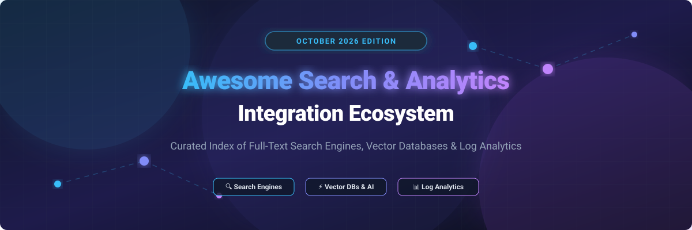

# 🔍 Awesome Search & Analytics Integration Ecosystem

  
  
  
  
  
  
  

---

## 📌 Executive Overview & Market Context

This repository tracks notable **commercial search and analytics platforms** and **open-source GitHub projects** indexing, querying, and analyzing structured, unstructured, and vector data. It covers traditional full-text search engines, log analytics platforms, instant application search APIs, and cutting-edge vector databases powering Retrieval-Augmented Generation (RAG) and AI applications.

---

## 📚 Table of Contents

- [☁️ SaaS / Managed Search & Analytics Platforms](#%EF%B8%8F-saas--managed-search--analytics-platforms)
- [🔓 Open-Source Search Engines & Vector Databases](#-open-source-search-engines--vector-databases)
  - [⚡ Top Open-Source Projects (Sorted by Stars)](#-top-open-source-projects-sorted-by-stars)
  - [💡 Category Breakdown & Architectural Recommendations](#-category-breakdown--architectural-recommendations)
- [🤝 How to Contribute](#-how-to-contribute)
- [⚠️ Important Notes & Security Disclaimer](#%EF%B8%8F-important-notes--security-disclaimer)
- [💖 Support & Community](#-support--community)
- [⭐ Star History](#-star-history)

---

## ☁️ SaaS / Managed Search & Analytics Platforms

📈 **Market Insight & Sector Overview**: The global Search, Vector Database, and Search Analytics market is estimated at **$12.5 Billion+ in 2026** (projected to exceed $22 Billion by 2030 with a CAGR of ~18.5% driven by enterprise AI adoption, RAG architectures, and real-time observability). The market is **moderately fragmented**: while cloud hyperscalers and enterprise incumbents maintain high market share, the explosive growth of AI semantic search and developer-centric open-source engines has split workload preferences across specialized domain leaders rather than a single winner-take-all winner.

Below is the comparison of top commercial search platforms, sorted by **Company Size / Valuation (Descending)**:

| Product Name | Company Size / Valuation | Starting Tier Price | Free Tier / Trial Limits | Best For & Key Features |
| :--- | :--- | :--- | :--- | :--- |
| **[Amazon OpenSearch Service](https://aws.amazon.com/opensearch-service/)** | **$2.3 Trillion** (AWS / Amazon) | **$0.024 / hour** (~$17.28/month base t3.small.search) | **AWS Free Tier**: 750 hrs/month of t2/t3.small.search + 10 GB storage for 12 months | **AWS-native search & log analytics**. Best for AWS cloud workloads and managed log pipelines. |
| **[Elastic Cloud](https://www.elastic.co/cloud)** | **$8.5 Billion** Market Cap ($1.15B ARR) | **$95 / month** (Standard Cloud Deployment) | **14-Day Free Trial** (Full Elastic Cloud features access, no credit card required) | **Enterprise search & observability**. Elasticsearch, Kibana, APM & security analytics reference. |
| **[Algolia](https://www.algolia.com/)** | **$2.25 Billion** Valuation | **$0.50 per 1,000 search requests/mo** (Grow Plan) | **Free Plan Forever**: 10,000 search requests/month & 10,000 indexed records | **Instant application search**. Gold standard for e-commerce search, faceted filtering, and site discovery. |
| **[Pinecone](https://www.pinecone.io/)** | **$750 Million** Valuation | **$50 / month base** + $0.00045/GB-hour (Standard Serverless) | **Starter Free Plan Forever**: 2 GB storage (~100k 768-dim vectors), 1 index | **Managed vector database**. Leading cloud-native vector platform for AI, LLM memory & RAG applications. |
| **[Coveo](https://www.coveo.com/)** | **$700 Million** Market Cap (~$120M ARR) | **$600 / month** (Pro Starter Package) | **30-Day Free Trial** (Sandbox environment, up to 10,000 items indexed) | **Enterprise AI search**. Unified search across Salesforce, ServiceNow, SharePoint & enterprise tools. |
| **[Meilisearch Cloud](https://www.meilisearch.com/cloud)** | **$150 Million** Valuation | **$30 / month** (Build Plan: 100K search requests & docs) | **14-Day Free Trial** (Includes 100,000 build credits for search requests & document indexing) | **Developer-friendly search API**. Ultra-fast, typo-tolerant search for modern web and mobile apps. |
| **[Typesense Cloud](https://typesense.org/cloud/)** | **$50 Million** Valuation | **$21.60 / month** ($0.03/hr for 0.5 GB RAM node) | **$720 Free Credits for 1st Year** ($60/month recurring credits for new developer accounts) | **In-memory application search**. High-performance, cost-effective open-source alternative to Algolia. |
| **[Vespa Cloud](https://vespa.ai/)** | **$40 Million** Valuation | **$29 / month** ($0.04/node-hour base) | **$300 Free Credits for 30 Days** (Trial zone node allocation for AI experimentation) | **Large-scale AI search engine**. Tensor processing, dynamic vector ranking, and real-time computation at scale. |
| **[Solr Cloud (SearchStax)](https://www.searchstax.com/)** | **$25 Million** Valuation | **$35 / month** (SearchStax Managed Solr Dev Small) | **14-Day Free Trial** (Single-node cluster with up to 5 GB storage included) | **Managed Apache Solr platform**. High availability enterprise search, Solr clustering, and search analytics. |
| **[Marqo Cloud](https://www.marqo.ai/)** | **$20 Million** Valuation | **$49 / month** (Basic Tier: 1 vector pod, 100k vectors) | **30-Day Free Trial** ($100 compute credits included for multimodal embedding testing) | **Multimodal tensor search engine**. Native image-to-text, vector, and hybrid search for AI applications. |

---

## 🔓 Open-Source Search Engines & Vector Databases

Search and analytics represents one of the strongest open-source ecosystems in developer tooling. Below is the comprehensive index of leading open-source search engines, vector databases, and storage engines, sorted strictly by **GitHub Star Count (Descending)**.

### ⚡ Top Open-Source Projects (Sorted by Stars)

| Project & Repository | GitHub Stars Badge | License | Core Focus & Description |
| :--- | :--- | :--- | :--- |
| **[Elasticsearch](https://github.com/elastic/elasticsearch)** |  | SSPL / Elastic License | **Distributed search & analytics engine**. The enterprise standard for full-text search, log analytics, and structured data indexing. |
| **[Meilisearch](https://github.com/meilisearch/meilisearch)** |  | MIT | **Lightning-fast, typo-tolerant search engine**. Minimal configuration needed; popular open-source Algolia replacement for web and mobile apps. |
| **[Milvus](https://github.com/milvus-io/milvus)** |  | Apache-2.0 | **Cloud-native vector database**. Built for scale with support for multi-billion vector datasets and real-time similarity search. |
| **[Typesense](https://github.com/typesense/typesense)** |  | GPL-3.0 | **Fast, typo-tolerant search engine written in C++**. Built for instant search experiences with low memory footprint and simple integration. |
| **[Qdrant](https://github.com/qdrant/qdrant)** |  | Apache-2.0 | **High-performance vector search engine in Rust**. Native support for payload filtering, vector similarity, and RAG pipelines. |
| **[Sonic](https://github.com/valeriansaliou/sonic)** |  | MPL-2.0 | **Fast, lightweight search backend in Rust**. Designed to be a simple, low-memory identifier index alternative to Elasticsearch. |
| **[Chroma](https://github.com/chroma-core/chroma)** |  | Apache-2.0 | **AI-native open-source embedding database**. Focuses on developer experience and simple integration into Python and TypeScript LLM stacks. |
| **[ZincSearch](https://github.com/zincsearch/zincsearch)** |  | Apache-2.0 | **Lightweight Elasticsearch alternative in Go**. Low resource consumption, single binary deployment, and built-in UI dashboard. |
| **[Pgvector](https://github.com/pgvector/pgvector)** |  | PostgreSQL License | **Open-source vector similarity search for PostgreSQL**. Adds vector storage, L2 distance, inner product, and cosine distance indexing. |
| **[Weaviate](https://github.com/weaviate/weaviate)** |  | BSD-3-Clause | **Modular vector database with ML model integrations**. Offers GraphQL API, hybrid search (BM25 + vectors), and automated embedding generation. |
| **[OpenSearch](https://github.com/opensearch-project/OpenSearch)** |  | Apache-2.0 | **Apache-licensed search and analytics suite**. Community-driven fork of Elasticsearch 7.10 backed by AWS, SAP, and major enterprise contributors. |
| **[Tantivy](https://github.com/quickwit-oss/tantivy)** |  | MIT | **Full-text search engine library in Rust**. Highly optimized indexer and search library benchmarked faster than Apache Lucene in specific workloads. |
| **[Quickwit](https://github.com/quickwit-oss/quickwit)** |  | AGPL-3.0 | **Cloud-native log search engine on S3 / Object Storage**. Delivers sub-second search queries directly over cost-effective object storage. |
| **[LanceDB](https://github.com/lancedb/lancedb)** |  | Apache-2.0 | **Developer-first serverless vector database**. Built on the Lance columnar data format for fast multimodal search and vector retrieval. |
| **[Manticore Search](https://github.com/manticoresoftware/manticoresearch)** |  | GPL-3.0 | **Fast open-source database for full-text search**. High-speed alternative to Sphinx search with SQL integration and JSON evaluation. |
| **[Apache Solr](https://github.com/apache/solr)** |  | Apache-2.0 | **Enterprise search platform powered by Apache Lucene**. Proven reliability for large enterprise search applications, faceted navigation, and highlighting. |
| **[Apache Lucene](https://github.com/apache/lucene)** |  | Apache-2.0 | **The foundational Java full-text search library**. Core engine powering Elasticsearch, Apache Solr, OpenSearch, and enterprise platforms. |
| **[Vespa](https://github.com/vespa-engine/vespa)** |  | Apache-2.0 | **AI-powered search & vector engine at scale**. Handles combined vector search, full-text evaluation, and deep machine learning model inference. |
| **[Marqo](https://github.com/marqo-ai/marqo)** |  | Apache-2.0 | **Tensor search engine for AI applications**. Native integration for image, text, and multimodal embeddings with built-in inference capabilities. |

---

### 💡 Category Breakdown & Architectural Recommendations

- **Full-Text & Enterprise Log Search**: Use **OpenSearch** or **Elasticsearch** for high-volume logs, security analytics, and enterprise document search. For lightweight Go deployments, choose **ZincSearch**. For object storage scale with ultra-low storage cost, choose **Quickwit**.
- **Instant Application & Site Search**: Use **Meilisearch** or **Typesense** for front-end search bars, e-commerce product catalogs, and instant typo-tolerant filtering.
- **AI Vector Search & RAG Memory**: Deploy **Qdrant**, **Milvus**, or **Weaviate** for high-performance dedicated vector databases. For local Python/JS applications, use **Chroma** or **LanceDB**. If you already run PostgreSQL, install **Pgvector** to avoid adding extra database infrastructure.
- **Billion-Scale AI Tensor Search**: Use **Vespa** for complex ranking, real-time ML inference, and massive web-scale search systems.

---

## 🤝 How to Contribute

Contributions are highly welcome! Please follow these simple steps:

1. **Fork the Repository**: Click the fork button at the top right of this page.
2. **Add or Update Entries**: Update `README.md` following the tabular layout. Include exact starting prices, free tier details, and official links.
3. **Validate GitHub Links**: Ensure all open-source repo links and star badges link to valid stargazers pages.
4. **Submit a Pull Request**: Open a PR with a clear summary of your changes.

---

## ⚠️ Important Notes & Security Disclaimer

- **Security & Data Sovereignty**: Search and analytics platforms index business-critical data. Always enforce index encryption at rest, TLS in transit, role-based access control (RBAC), and network isolation.
- **Vector Embedding Costs**: Vector databases store vectors but require embedding generation models (OpenAI, Cohere, HuggingFace, sentence-transformers). Factor in inference latency and token costs.
- **License Awareness**: OpenSearch, Qdrant, Milvus, and Apache Lucene are Apache-2.0 licensed. Meilisearch is MIT licensed. Typesense is GPL-3.0 licensed. Elasticsearch uses SSPL/Elastic License. Check compliance with your commercial licensing requirements.

---

## 💖 Support & Community

Thank you for exploring **Awesome Search & Analytics Integration**! If this repository helped you find the right search engine or vector database for your project, please consider showing your support:

- ⭐ **Star this repository** to help others discover it!
- 🔀 **Fork & Contribute** by submitting pull requests for new search and analytics tools.
- 📢 **Share with your network** on Twitter, LinkedIn, and developer forums.
- ☕ **Sponsor the Maintainer**: [Buy a coffee & support ongoing development on GitHub Sponsors](https://github.com/sponsors/ishandutta2007)

---

## ⭐ Star History

---

  Curated with ❤️ by <a href="https://github.com/ishandutta2007">ishandutta2007</a> for developers, search engineers, and data teams worldwide.

